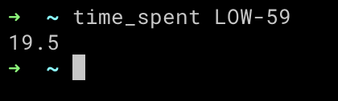
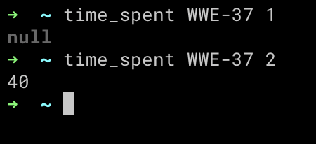

Get *your* total hours spent in Harvest on a Jira ticket 

# Example Usage

By default it only searches 1 page returned from the API (100 entries) which is roughly 1 month.
To search more entries, add a page count 

# Dependencies
- [jq](https://stedolan.github.io/jq/download/) (`brew install jq`)

# Installation
`sh <(curl github/install.sh)`

Create a Harvest Personal Access Token [here](https://id.getharvest.com/developers)

# Uninstalling 
`rm $(which time_spent) && rm ~/.harvest-env`